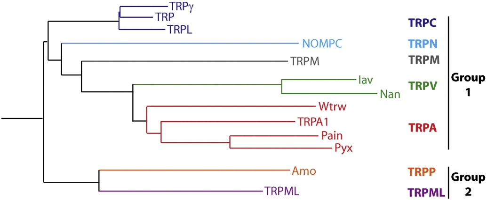
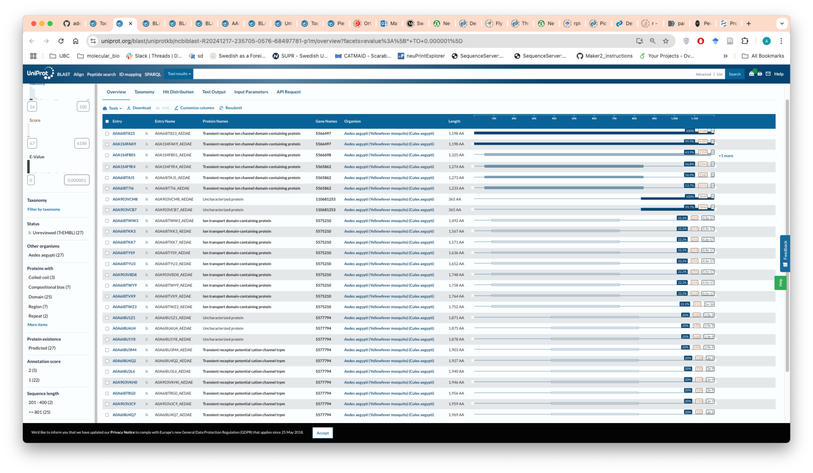
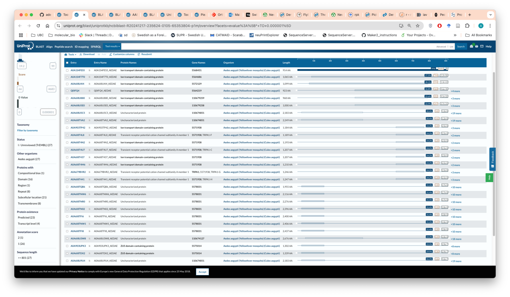
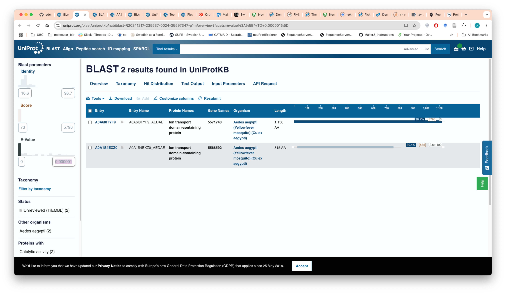
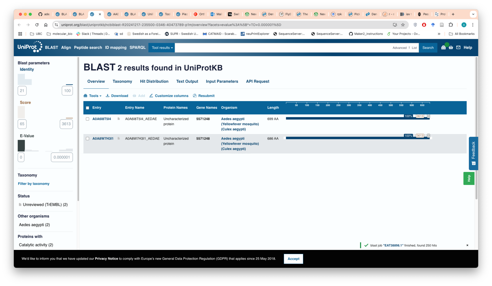
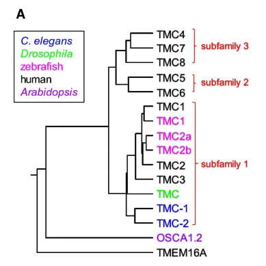
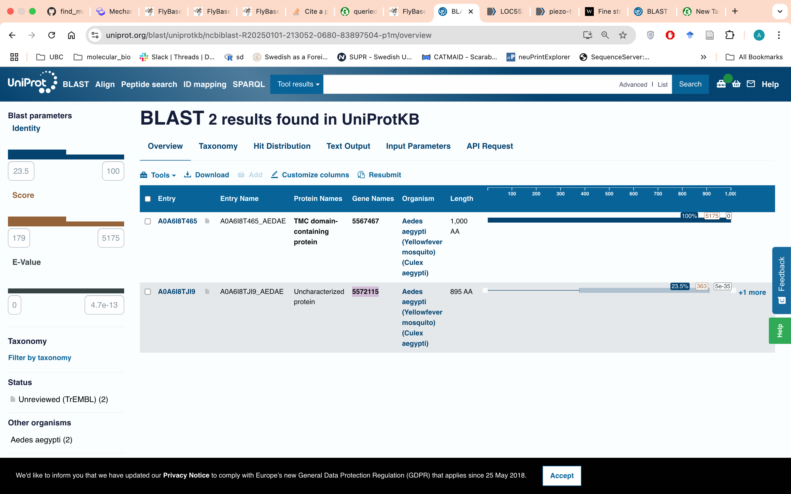
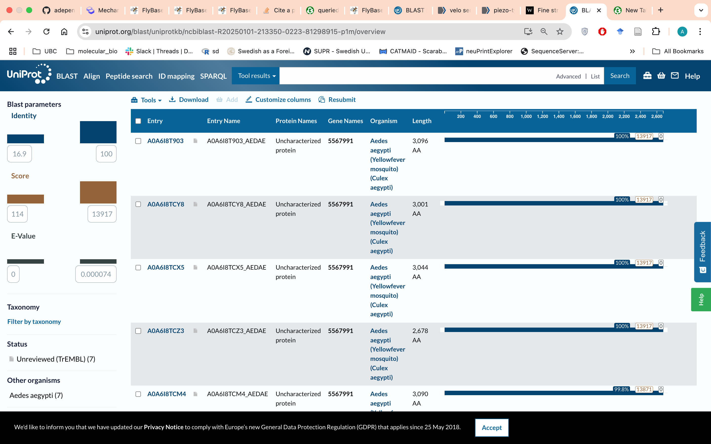
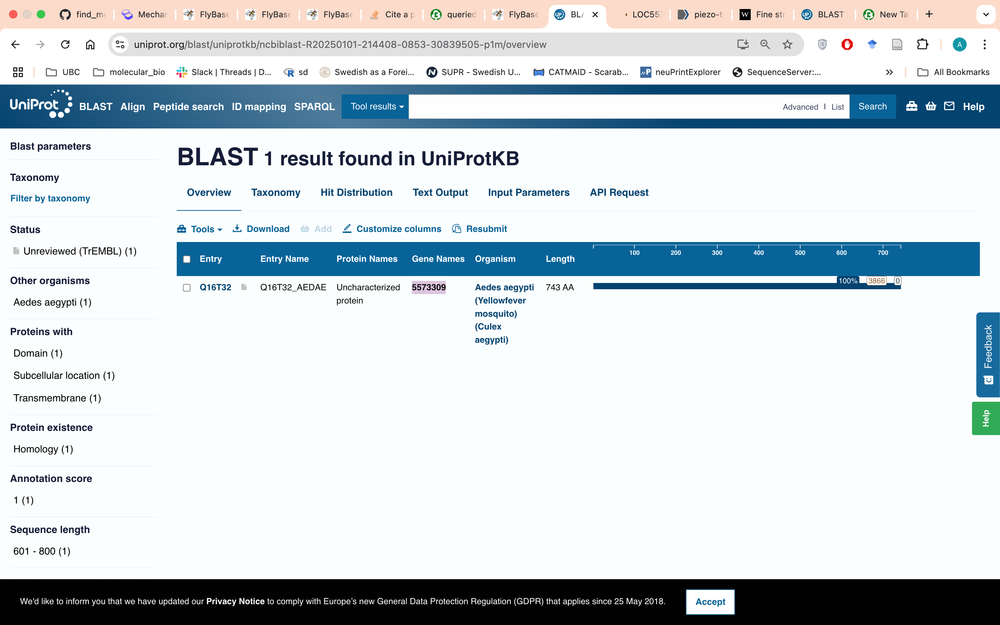
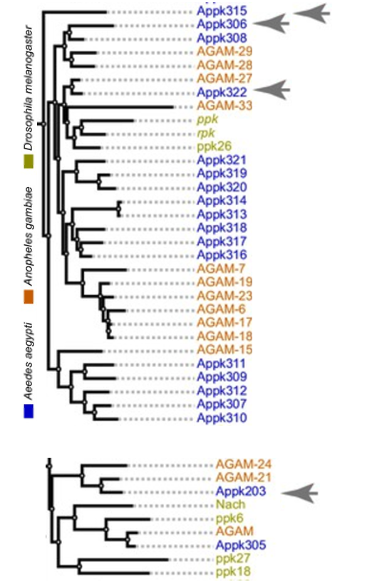

<!-- TABLE OF CONTENTS -->
<details>
  <summary>Table of Contents</summary>
  <ol>
    <li>
      <a href="#About">About</a>
    </li>
    <li>
      <a href="#Research">Research</a>
      </li>
      <li>
      <a href="#Installation">Installation</a>
      <ul>
          <li><a href="#Dependencies">Dependencies</a></li>
      </ul>
    </li>
    <li><a href="#Usage">Usage</a></li>
        <li>
      <a href="#Analysis">Analysis</a>
      </li>
        <li>
      <a href="#Reference">Reference</a>
      </li>

  </ol>
</details>

## About 
This Github repository goes overs how candidate mechanosensory genes were selected in *Aedes aegypti*. 

First, the research conducted to find out what genes are potentially mechanosensory in *A. aegypti*. 

Second, 3 scripts to 1) download summary files genes of interest, 2) select gene expression data for genes of interest and 3) plot data. (The scripts runs on the terminal and R(Rstudio=2022.12.0+353).) 

Third, checking litterature to determine best candidate gene.


## Research
### finding mechanosensory families
Based off research conducted in *Drosophila melanogaster*, amongst other model organisms, several gene families are known to be mechanosensory[1].
- TRP (transient receptor potential)
- PPK (pickpockets, a subfamily of Deg/enacs)
- Piezo
- TMC (transmembrane channel)
- TMEM63 (OSCA)

### TRP
13 trp genes exist in *Drosophila melanogaster*, TRP, TRPL, TRPgamma, TRPA1, Pain, Pyx, Wtrw, Nompc, Iav, Nan,TRPM, Amo, TRPML. These trp channels belong to 4 subgroups, TRPC, TRPN, TRPM, TRPV[2](see figure below,[2]).

<a href="figures/trp_tree.jpg">
    
  </a>


15 are found in *Aedes aegypti*.
As seen by two different querying methods. Firstly, when querying NCBI (exact querying line can be found in the file mechano_aegypti.sh) and when using flybase orthologs to blast against *A. aegypti* dataset. How i queried using flybase and blast is as follows.

#### querying flybase
I selected one trp gene belonging from each of the trp subgroups(see figure above,[2]) and using flybase, I found an ortholog in *Aedes aegypti* for these 4 candidate trp channels (in flybase, under "Other Organism Orthologs (via OrthoDB)"):
- trp = trp (gi=5566497) https://flybase.org/reports/FBgn0003861.htm
- pain = pain (gi=5568431) https://flybase.org/reports/FBgn0060296.htm
- iav =  iav (gi=5571743) https://flybase.org/reports/FBgn0086693.htm
- TRPML = mucolipin (gi=5571248) https://flybase.org/reports/FBgn0262516.htm


Then running a blast on uniprot using "UniprotKB reference proteomes + Swiss-prot" database and restricting it to *Aedes aegypti* genes with a minimum e-value of <0.000001 i found 15 trp channels over the 4 subgroups.

##### trp
- Trp-5566497 (two isoform2)
- Trpgamma- 5565862 (3 isoforms)
- Trp-like – 110681253 (2 isoforms)
- Nompc-5575210 (9 isoforms?)
- Trpm – 5577794 (10 isoforms)
- 
<a href="figures/trp_blast_screenshot.png">
    
  </a>


##### pain
- Pain – 5568431
- Pain-like 5564686
- Pain-like 5572129
- Pyx – 5564219
- (wtrw)Pyx-like 110679259
- (wtrw)Pyx-like 110679258
  
<a href="figures/pain_blast_screenshot.png">
    
  </a>

##### iav
iav - 5571743
nan - 5568592

<a href="figures/iav_blast_screenshot.png">
    
  </a>

##### mucolipin
TRPML-mucolipin – 5571248(2 isoforms)

<a href="figures/mucolipin_blast_screenshot.png">
    
  </a>

### ppk
32 are found in mosquitoes.
32 ppks had previously been described in *A. aegypti* [3] and querying NCBI confirmed this number (exact querying line can be found in the file mechano_aegypti.sh).

### tmc
Only one tmc exists in *D. melanogaster*, however in other model species tmc exists divided into three subfamilies (see figure below, Yue, 2019).

<a href="figures/tmc_tree.png">
    
  </a>
  
3 tmcs were found in *A. aegypti*
Firstly, when querying NCBI (exact querying line can be found in the file **mechano_aegypti.sh**) only two tmc genes are found (tmc5, tmc7). When using flybase, one additional ortholog is found labelled as an uncharacterized gene in *A. aegypti*. Then, blasting tmc7 on NCBI against all *A. aegypti* genes  only returns tmc5 and tmc7 (and their isoforms). How i queried using flybase and blast is as follows.

#### querying flybase
The one uncharacterized gene match was found in flybase (under "Other Organism Orthologs (via OrthoDB)"). https://www.orthodb.org/?ncbi=5566135

Then running a blast with tmc7 gene on the uniprot using "UniprotKB reference proteomes + Swiss-prot" database and restricting it to *Aedes aegypti* genes with a minimum e-value of <0.000001 I find the 2 other tmc gene.

<a href="figures/tmc_blast_screenshot.png">
    
  </a>
  
### piezo
1 found in *Aedes aegypti*.
As seen by two different querying methods. Firstly, when querying NCBI (exact querying line can be found in the file **mechano_aegypti.sh**) and when using flybase orthologs to blast against *A. aegypti* dataset. How i queried using flybase and blast is as follows.
#### querying flybase
One match was found in flybase (under "Other Organism Orthologs (via OrthoDB)"). https://flybase.org/reports/FBgn0264953.htm

Then running a blast on uniprot using "UniprotKB reference proteomes + Swiss-prot" database and restricting it to *Aedes aegypti* genes with a minimum e-value of <0.000001 i found the 1 piezo gene.

<a href="figures/piezo_blast_screenshot.png">
    
  </a>
  
### tmem63
1 found in *Aedes aegypti*.
As seen by two different querying methods. Firstly, when querying NCBI (exact querying line can be found in the file **mechano_aegypti.sh**). Secondly tried to find an ortholog on flybase and none existed. However, when blasting the *D. melanogaster* gene against the *A. aegypti* dataset the 1 tmem63 was found. How i queried using flybase and blast is as follows.

#### querying flybase
No match was found in flybase (under "Other Organism Orthologs (via OrthoDB)"). https://flybase.org/reports/FBgn0033259.htm

Then running a blast on uniprot using "UniprotKB reference proteomes + Swiss-prot" database and restricting it to *Aedes aegypti* genes with a minimum e-value of <0.000001 i found the 1 tmem63 gene.

<a href="figures/tmem63_blast_screenshot.png">
    
  </a>
  
## Installation
This program can be directly installed from github (green Code button, top right).

### Conda environment
First make sure conda is installed. If you do not have conda, refer to online resources on how to install conda.
https://docs.conda.io/projects/conda/en/latest/user-guide/install/index.html

Once installed, we can make a conda environment.

```bash=
conda create --name mechano
#activate
conda activate mechano
```

### Part1: Querying NCBI
This part requires  NCBI's Entrez Direct (EDirect) terminal app to download the proteomes from their database. The following link can be used to download the terminal app.
```bash=
sh -c "$(curl -fsSL https://ftp.ncbi.nlm.nih.gov/entrez/entrezdirect/install-edirect.sh)"
```
After installing it will  ask if you would like to automatically install the path variables. Select yes.

If it does not work refer the NCBI EDirect webpage https://www.ncbi.nlm.nih.gov/books/NBK179288/.


Once set up, activate EDirect in this terminal session with the following.

```bash=
export PATH=${HOME}/edirect:${PATH}
```


Wget is also required to download the genes of interest. So on a mac, one has to install homebrew to install wget.
```bash=
#install homebrew (mac OS 13.1)
/bin/bash -c "$(curl -fsSL https://raw.githubusercontent.com/Homebrew/install/HEAD/install.sh)"
#install wget
brew install wget
```

### Part2: Subsetting trancriptome data
The python version for running python script is python= 3.12.1 
```bash=
conda install python= 3.12.1 
```

#### Dependencies
The script runs with pip=24.0, pillow=10.2.0, numpy=1.26.3, matplotlib=3.8.2 and scikit-image=0.22.0.

Update your dependencies, if you do not already have the versions for these dependencies.

```bash=
pip install --upgrade pip==24.0

pip install pillow==10.2.0 numpy==1.26.3 matplotlib==3.8.2 scikit-image==0.22.0 tqdm==4.66.2
```

### Part3: Plotting transcriptome data
The script runs with Rstudio=2022.12.0+353. Rstudio can be downloading following this link.
https://posit.co/download/rstudio-desktop/
Code not yet tested in R.

## fixes
currently no completely documented code.
include more detailed methods on how you queried databases. (go to folder blast data to include photos)
have the final fasta file as output
cite sensilla paper for mosquitoes

## Usage

### Part1: Querying NCBI
run the following code in the terminal.

```bash=  
#to be able to run script
chmod +x mechano_aegypti.sh
./mechano_aegypti.sh
```

### Part2: Subsetting transcriptome data
run Python script to get subset transcriptome data.
In the input folder should be the complete transcriptome.
```bash=
python select_gene_of_interest.py  -i input -o output -g mechano_aegypti.txt
```
### Part3: Plotting transcriptome data
The script can be run in Rstudio.
Before running the code, the second line must be changed to the directory where the input files are.

Once this is changed the script can be run by pressing SOURCE in the top right of the code pane in Rstudio.

The final output should be two pdfs plotting the data (abdominal_tip_mechano.pdf,all_tissue_mechano.pdf) and a list of the top ten most expressed mechanosensory genes in the abdominal tip of the female *A. aegypti*.

    transient2                                ppk322 
     0.8233333                             0.8371717 
        ppk203                                ppk306 
     0.9377027                             0.9443272 
     painless2                                Tmem63                                0.9990644                             1.4740794 
     mucolipin                    tmc-like protein 5 
     1.5855028                             1.5993977 
    piezo-type                                  pain 
     1.6310306                             1.7238047 

## Analysis
As we are looking for receptors that might be triggered with minute differences in textures, we are likely looking at a gentle touch receptor.

### unlikely candidates
Removing genes that are not associated with gentle touch or touch at all, from our list of top ten candidate receptors, this brings it down to 8.

1. ~~pain~~
1. piezo
1. tmc 5
1. ~~TRPML-mucolipin~~
1. Tmem63
1. painless-like
1. ppk306
1. ppk203
1. ppk322
1. transient 2 (pyrexia-like)

#### Pain and Pain-like
Pain (and ppk) sense friction during pupation, when knocked out pupation height is wrong as they likely can't sense where they are in the fruit before pupating
Pain (TRPA1) allows for the response to noxious touch and involved in escape response to strong mechanical stimuli[2].

#### TRPML
localized in plasma and not associated with touch, but rather neurodengenration and motor deficiencies, accumulation of lysosome vesiciles (similar results in humans)[2].

### improbable candidates
From our list of top 10 candidate receptors, 2 genes seem to have paralogs not found in *D. melanogaster* and whose ortholog in D. melanogaster* is not associated to gentle touch receptors.

1. ~~pain~~
1. piezo
1. tmc 5
1. ~~TRPML-mucolipin~~
1. Tmem63
1. ~~painless-like~~
1. ppk306
1. ~~ppk203~~
1. ppk322
1. ~~transient 2 (pyrexia-like)~~


#### Pain-like
One of two orthologs to pain in drosophila. If orthologous in function to pain, not as interesting of a receptor[2]. 

#### pyrexia-like
nociception response to high heat. and involved in gravitaxis[2].

#### ppk 203
In the ppk phylogenetic tree most related to nach, ppk18 and ppk27 (see figure below, Matthews 2019). nach is associated to liquid clearance in the tracheal system (flybase, 2024). Both ppk18 and ppk27 are predicted to be sodium ion transmembrane transport genes. Both have no phenotype, and both are viable but ppk27 is partially lethal with a majority dying.

<a href="figures/ppk_tree.png">
    
  </a>


### likely candidates
That leaves us with 5 potential gentle touch receptors.
1. ~~pain~~
1. piezo
1. tmc 5
1. ~~TRPML-mucolipin~~
1. Tmem63
1. ~~painless-like~~
1. ppk306
1. ~~ppk203~~
1. ppk322
1. ~~transient 2 (pyrexia-like)~~

#### Piezo
Piezo is known as a mechanotransduction gene and has been seen to have impacts on egg-laying preference when there are mild differences in substrate hardness[4].

#### tmc 5
Only one tmc gene exists within flies (belonging to the first subfamily of tmcs). However, in *A. aegypti* there are 3 tmc genes each belonging to a separate subfamily of tmcs. The least information is known on tmc 5, however, tmc 7 has recently been seen in mice to suppress piezo activity in peripheral neurons hence reducing mechanosensation in the periphery[5]. tmc 7 in *A. aedes* is also highly expressed, just falling out of the top ten most expressed mechanosensory genes in the abdominal tip. In *D. melanogaster* tmc has also been seen to mediate subtle difference in substrate when determining egg-laying sites[4]. 

#### Tmem63
Tmem63 has been seen to mediate food preference based on food grittiness. It is done through the deflection of sensila on the labellum[6].

#### ppk306 & 322
Both of these ppks seem to fall in the same part of the phylogenetic tree however ppk322 seems to be more closely related to ppk,rpk and ppk26 which are all mechanosensitive genes. rpk is expressed in class III multidendritic neurons required for gentle touch in *D. melanogaster* larvae [7]. Both ppk and ppk26 are present in multidendritic class IV neurons and use the same pathway for mechanical nociception in *D. melanogaster* larvae although ppk is also involved in thermal nociception[8,9].

### best candidates
Based on observations from previous papers [10] is has been hypothesized that the deflection of sensilla on the abdominal tip positively affects egg-laying in mosquitoes. Knowing mechanosensory neuron types from *D. melanogaster*, type I, as opposed to type II, are reportedly sensila-based mechanosensory neurons. This immediately places both **Tmem63** and **piezo** as leading candidates to test preferential egg-laying on rougher surfaces in *A. aegypti*. 

Ranking the candidate genes:
1. piezo*
1. Tmem63
1. ppk322
1. ppk306*
1. tmc 5
1. tmc 7 

BEN's preference:
1. ppk306* (wanted to check out his previous work, and there is a high expression in males, important in mating)
2. ppk322
2. piezo* (already knocked out so interesting)
1. Tmem63 (not enough info)
1. tmc 5 (not enough info)
1. tmc 7 (not enough info)

 
## Reference
1. Kefauver, J. M., A. B. Ward, and A. Patapoutian. “Discoveries in Structure and Physiology of Mechanically Activated Ion Channels.” Nature 587, no. 7835 (November 2020): 567–76. https://doi.org/10.1038/s41586-020-2933-1.
2. Fowler, Melissa A., and Craig Montell. “Drosophila TRP Channels and Animal Behavior.” Life Sciences, TRP channels, GPCRS, endolipids and natural products: A tetrad that makes sense, 92, no. 8 (March 19, 2013): 394–403. https://doi.org/10.1016/j.lfs.2012.07.029.
3. Latorre-Estivalis, Jose Manuel, Francisca C Almeida, Gina Pontes, Hernán Dopazo, Romina B Barrozo, and Marcelo Gustavo Lorenzo. “Evolution of the Insect PPK Gene Family.” Genome Biology and Evolution 13, no. 9 (September 1, 2021): evab185. https://doi.org/10.1093/gbe/evab185.
4. Zhang, Liwei, Jie Yu, Xuan Guo, Jianhuan Wei, Ting Liu, and Wei Zhang. “Parallel Mechanosensory Pathways Direct Oviposition Decision-Making in Drosophila.” Current Biology 30, no. 16 (August 17, 2020): 3075-3088.e4. https://doi.org/10.1016/j.cub.2020.05.076.
5. Zhang, Xiaoxue, Jichen Shao, Caixue Wang, Chao Liu, Han Hao, Xinmeng Li, Yating An, et al. “TMC7 Functions as a Suppressor of Piezo2 in Primary Sensory Neurons Blunting Peripheral Mechanotransduction.” Cell Reports 43, no. 4 (April 23, 2024). https://doi.org/10.1016/j.celrep.2024.114014.
6. Li, Qiaoran, and Craig Montell. “Mechanism for Food Texture Preference Based on Grittiness.” Current Biology 31, no. 9 (May 10, 2021): 1850-1861.e6. https://doi.org/10.1016/j.cub.2021.02.007.
7. Tsubouchi, Asako, Jason C. Caldwell, and W. Daniel Tracey. “Dendritic Filopodia, Ripped Pocket, NOMPC, and NMDARs Contribute to the Sense of Touch in Drosophila Larvae.” Current Biology 22, no. 22 (November 20, 2012): 2124–34. https://doi.org/10.1016/j.cub.2012.09.019.
8. Guo, Yanmeng, Yuping Wang, Qingxiu Wang, and Zuoren Wang. “The Role of PPK26 in Drosophila Larval Mechanical Nociception.” Cell Reports 9, no. 4 (November 20, 2014): 1183–90. https://doi.org/10.1016/j.celrep.2014.10.020.
9. Zhong, Lixian, Richard Y. Hwang, and W. Daniel Tracey. “Pickpocket Is a DEG/ENaC Protein Required for Mechanical Nociception in Drosophila Larvae.” Current Biology 20, no. 5 (March 9, 2010): 429–34. https://doi.org/10.1016/j.cub.2009.12.057.
10. Rossignol, P. A., and S. B. McIver. “Fine Structure and Role in Behavior of Sensilla on the Terminalia of Aedes Aegypti (L.) (Diptera: Culicidae).” Journal of Morphology 151, no. 3 (1977): 419–37. https://doi.org/10.1002/jmor.1051510307.
